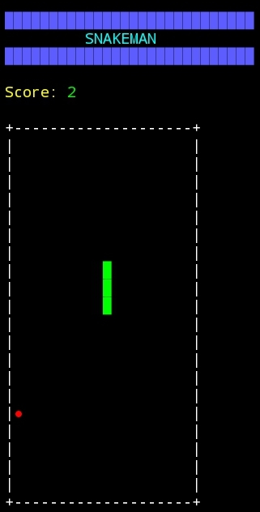

# 🐍 SNAKEMAN

Neon terminal-based Snake game built with Node.js for CLI environments (Termux compatible).

---

## 🎮 Features

- Real-time movement (no Enter required)
- WASD controls
- Neon ANSI interface
- Visible wall borders
- Speed increases progressively
- Sound beep on eat
- Triple beep on game over
- Score tracking
- Wall & self collision detection

---

## 🕹 Controls

W → Up  
A → Left  
S → Down  
D → Right  
CTRL + C → Exit  

---

## 🚀 Run

```bash
node index.js
```

---

## 📸 Run Game

TRAC Address:

```
trac1wfz0v8jn6cxccrc7f5n32xqfhlw6sz2zwhhzdutx69xc2uyc8lxsvdhunx
```

Proof Screenshot:



---

## 🛠 Tech Stack

- Node.js
- ANSI Escape Rendering
- Readline Raw Mode
- Interval Game Loop

---

## 🔥 Skills Demonstrated

- Real-time CLI input handling
- Terminal UI rendering
- Collision detection logic
- Dynamic difficulty scaling
- State-based game loop
- CLI sound trigger
- Clean modular game structure
- Minimal dependency architecture

---

## 📜 License

MIT
